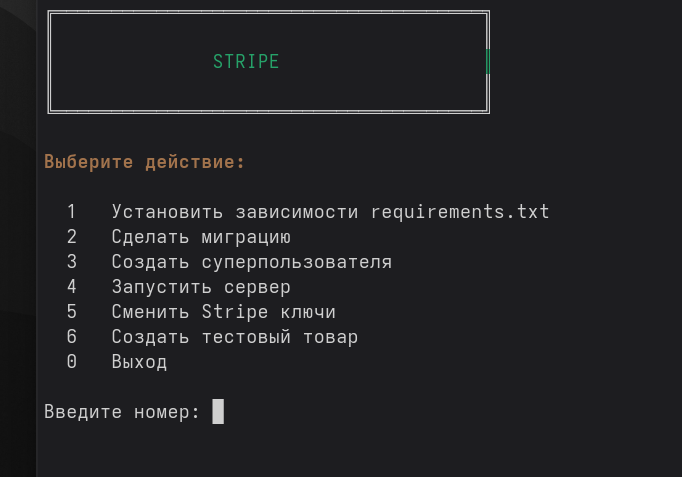

# Stripe Django Payments

Тестовое задание: Django + Stripe API для создания платёжных форм.

---

## ⚡ Быстрый старт



### Клонируем и запускаем скрипт:
```bash
# Клонирование
git clone https://github.com/Nami-can/Stripe_Project.git
cd Stripe_Project

# Даем права
chmod +x manage.sh

# Виртуальное окружение Linux/Mac
python3 -m venv venv
source venv/bin/activate

# Виртуальное окружение Windows
python -m venv venv
venv\Scripts\activate

# Создаем файл .env и добавляем ключи Stripe

# Запускаем скрипт
./manage.sh
```
## Обычный запуск
```bash 
git clone https://github.com/Nami-can/Stripe_Project.git
cd Stripe_Project

# Виртуальное окружение Linux/Mac
python3 -m venv venv
source venv/bin/activate

# Виртуальное окружение Windows
python -m venv venv
venv\Scripts\activate

# Установка зависимостей
pip install -r requirements.txt


# Создаем файл .env и добавляем ключи Stripe


# Миграции
python manage.py makemigrations
python manage.py migrate
python manage.py createsuperuser

# Запуск
python manage.py runserver
```
___
## 📋 Использование

### 1. Создание товара
Войдите в админ-панель и создайте товар:
- Откройте http://localhost:8000/admin/
- Нажмите "Добавить" рядом с "Товары"
- Заполните поля: название, описание, цена, валюта
- Нажмите "Сохранить"

### 2. Тестирование оплаты
- Перейдите на страницу товара: http://localhost:8000/item/1/
- Нажмите кнопку "Купить"
- Введите тестовые данные карты:
  - Номер: `4242 4242 4242 4242`
  - Срок: любая будущая дата (например, 12/28)
  - CVC: любые 3 цифры (например, 123)
- Нажмите "Оплатить"

## 🎯 Выполненные бонусные задачи

| Бонус | Статус |
|-------|--------|
| Environment variables (.env) | ✅ |
| Django Admin панель | ✅ |
| Модель Order (несколько Items) | ✅ |
| Модели Discount и Tax | ✅ |
| Мультивалютность (USD/RUB) | ✅ |
| Stripe Payment Intent | ✅ |
| Docker | ✅ |

### Дополнительные endpoints

| Метод | URL | Описание |
|-------|-----|----------|
| GET | `/buy-order/{id}/` | Создать платёж для заказа с несколькими товарами |
| GET | `/payment-intent/{id}/` | Создать Stripe Payment Intent для товара |
| GET | `/success/` | Страница успешной оплаты |
| GET | `/cancel/` | Страница отмены платежа |
